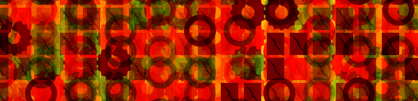

# Fancy Pattern Generator

A webapp that creates random texture patterns, which you can save as images.
It uses [pixi.js](https://www.pixijs.com/) to create few different shapes that get repeated and overlayed with different blend modes.
All options get choosen randomly.

## Usage

Open index.html in the dist folder.

Hotkeys:

- G - Generate new pattern
- S - Save pattern to disk

## Development

- `npm install`
- `npm run dev`

You can change the pattern generation settings in config.js.
